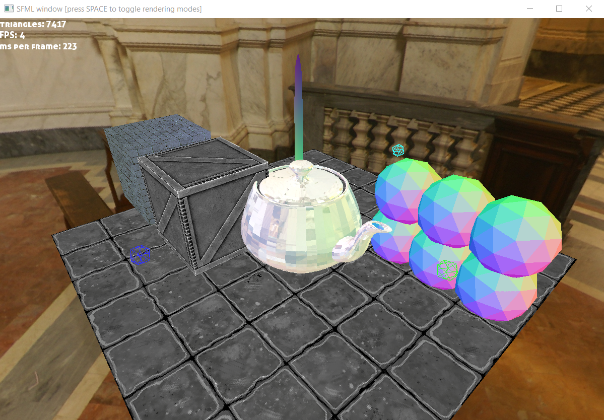

# 3d-renderer-from-scratch
Basic software 3d renderer (hopefully crossplatform) with minimum dependencies on other libraries  
For now the actual dependencies are the following:  
- SFML to render screen buffer and to handle keyboard and mouse input
- glm
- stb_image

Build:

This repository is a copy of visual studio 2019 project. 
One way to build the application on windows is to just use Microsoft Visual Studio 2019.
Alternatively, you can install the dependencies (SFML, glm, stb_image) yourself, and then link them to the source files.

Gallery:

