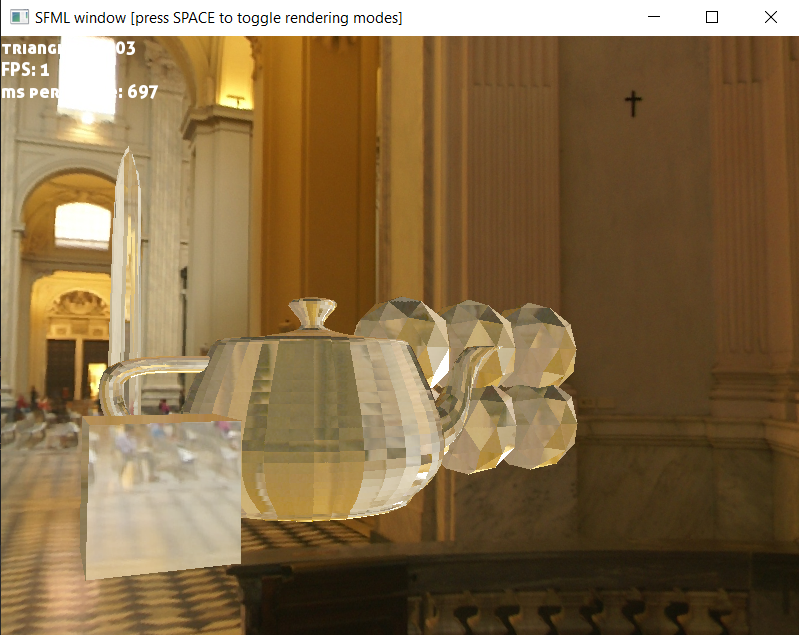
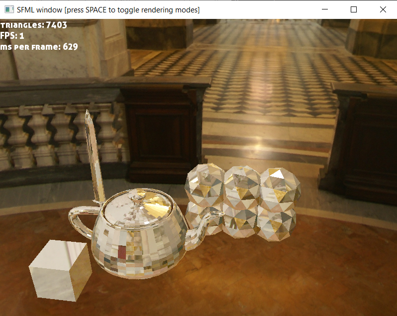

# 3d-renderer-from-scratch
Basic software 3d renderer (hopefully crossplatform) with minimum dependencies on other libraries  
For now the actual dependencies are the following:  
- SFML to render screen buffer and to handle keyboard and mouse input
- glm
- stb_image

TODO list:

Next up is: 
- [x] Clipping triangles against frustrum planes
- [x] Fix perspective-projection bug (done)
- [ ] ...

Potential new features:
- [ ] Vertex and/or Geometry shaders
- [x] Cubemap textures (work in progress)
- [ ] Different texture sampling modes
- [ ] Alpha blending
- [ ] Shadow mapping
- [ ] Different post-processing effects (e.g. FXAA)
- [ ] Mipmapping for textures
- [ ] ...

In general:
- [ ] improving perfomance
- [ ] cleaning up and refactoring code
- [ ] fixing bugs
- [ ] ...

Gallery:

