# 3d-renderer-from-scratch
## Описание
Программный 3D рендерер с минимальным количеством зависимостей от сторонних библиотек.

## Зависимости
- SFML
- glm
- dear ImGui

## Сборка
- Microsoft Visual Studio 2019
- Самостоятельная установка зависимостей и сборка исходников (cmake не используется в проекте).

## Генерация UML диаграмм
1. Копируем .h файлы в отдельную папку.
2. ```hpp2plantuml -i "*.h" -o output.puml```   (https://github.com/thibaultmarin/hpp2plantuml)
3. ```java -jar plantuml.jar output.puml -tsvg``` (https://plantuml.com/)

## Галерея (базовый рендерер)

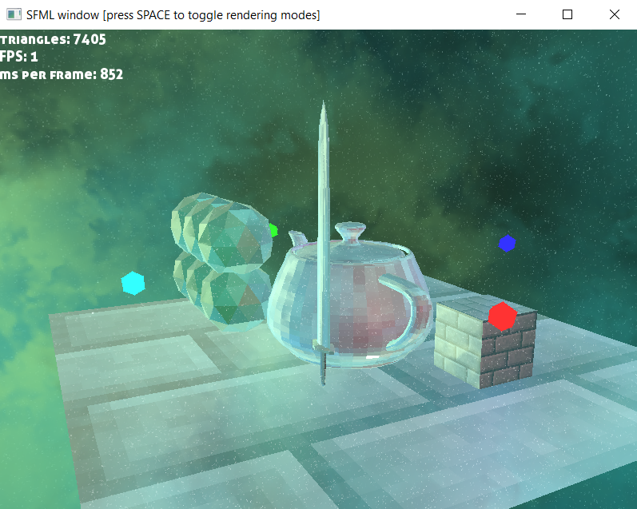
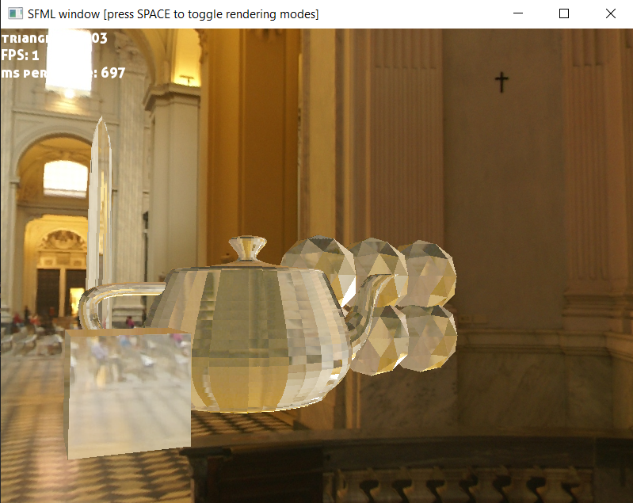
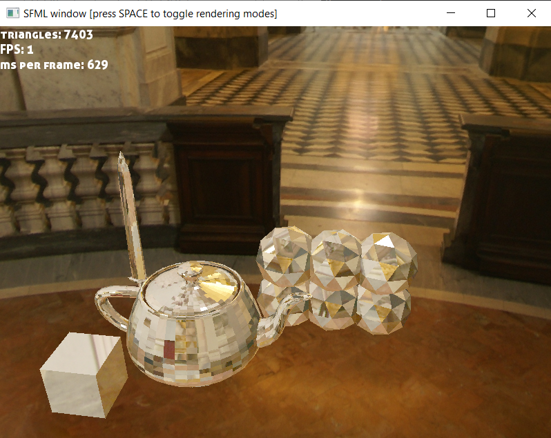
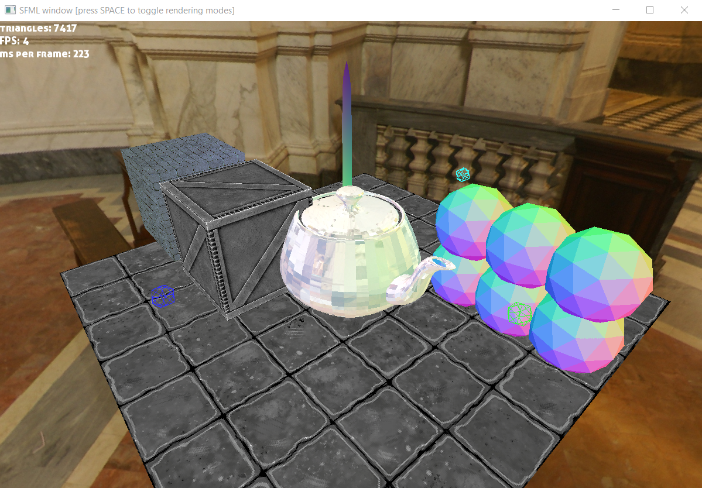
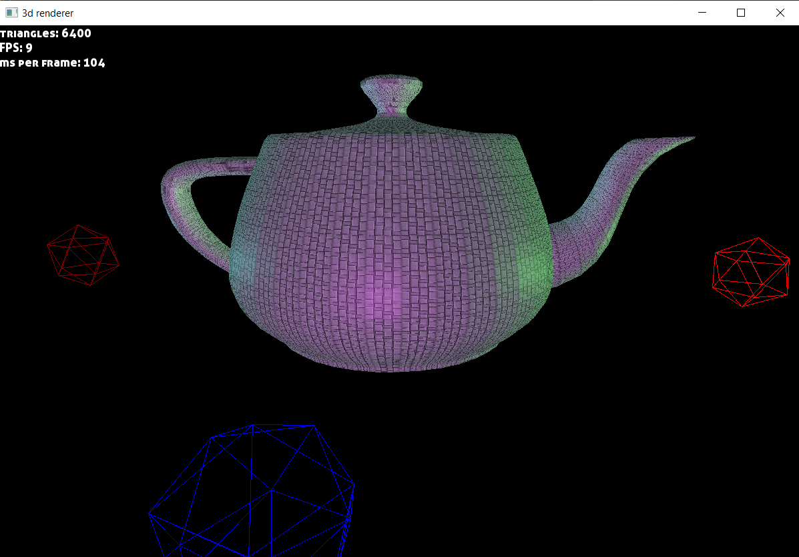
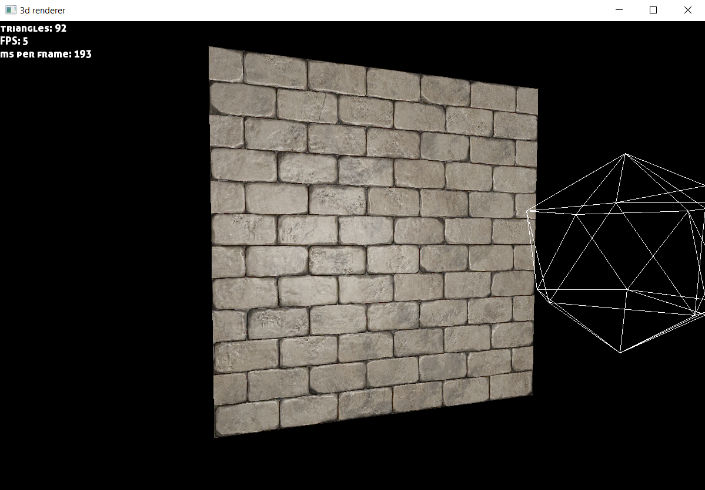

## Галерея (продвинутый рендерер)

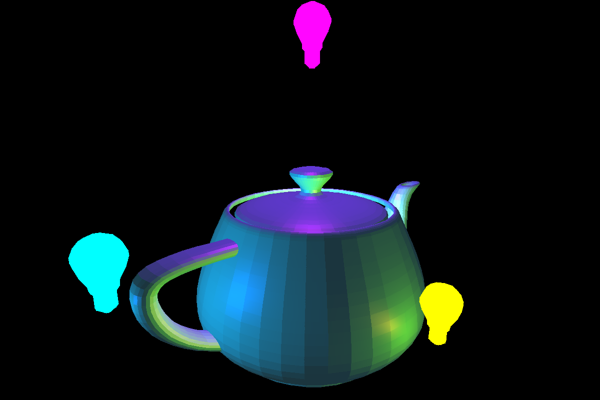
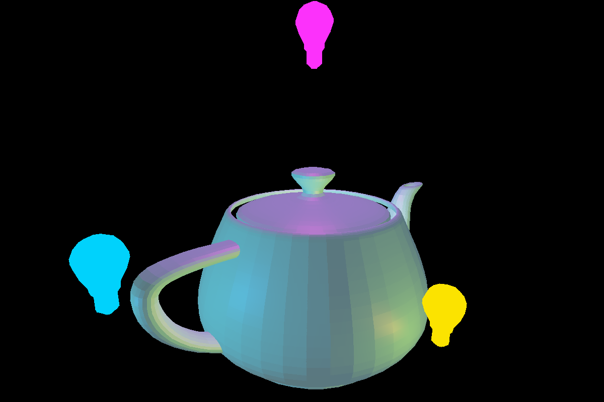
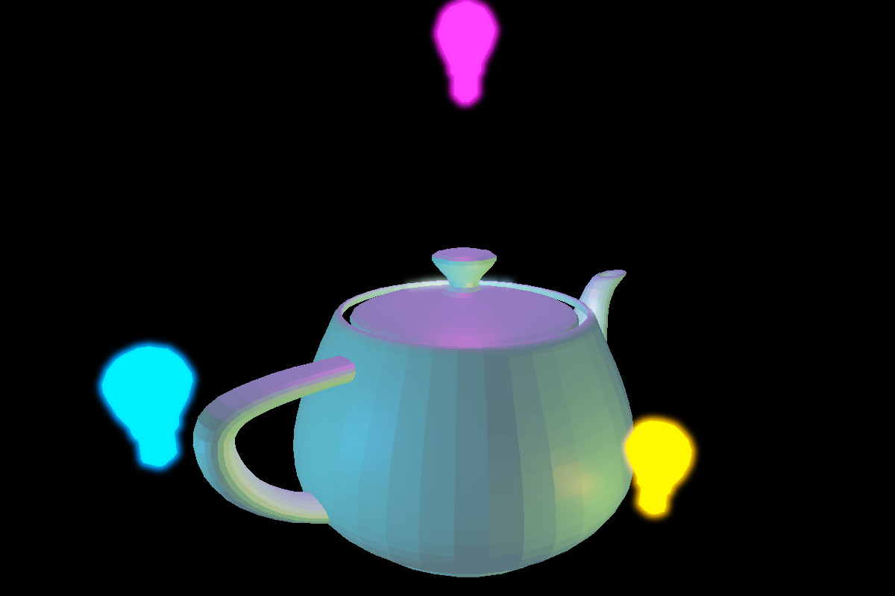
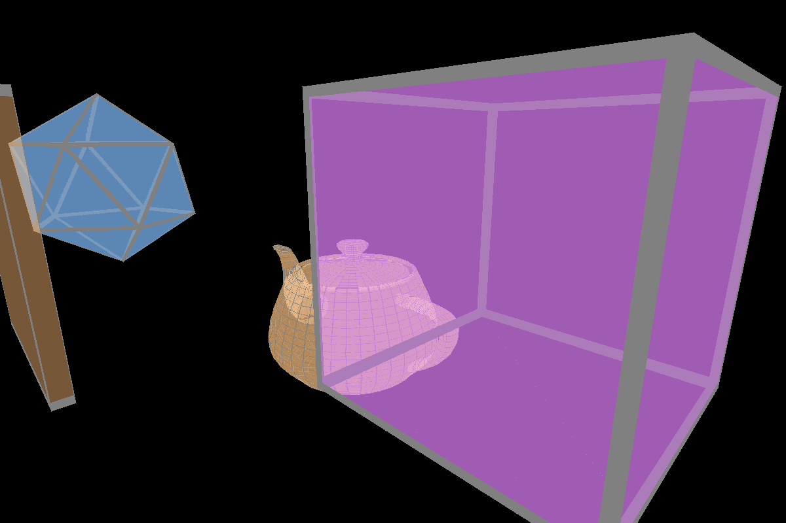
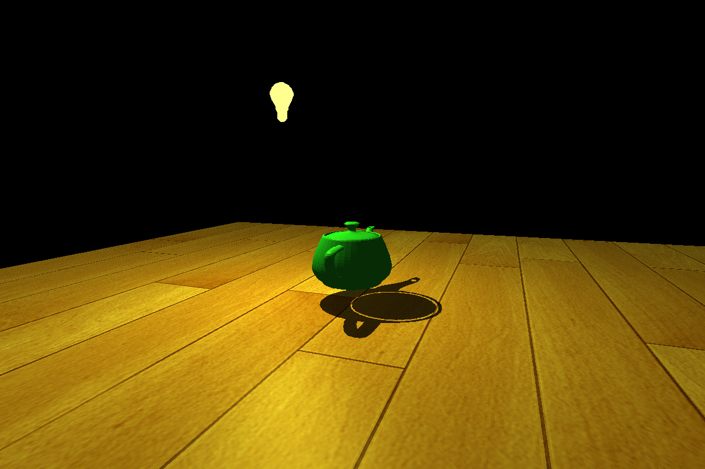
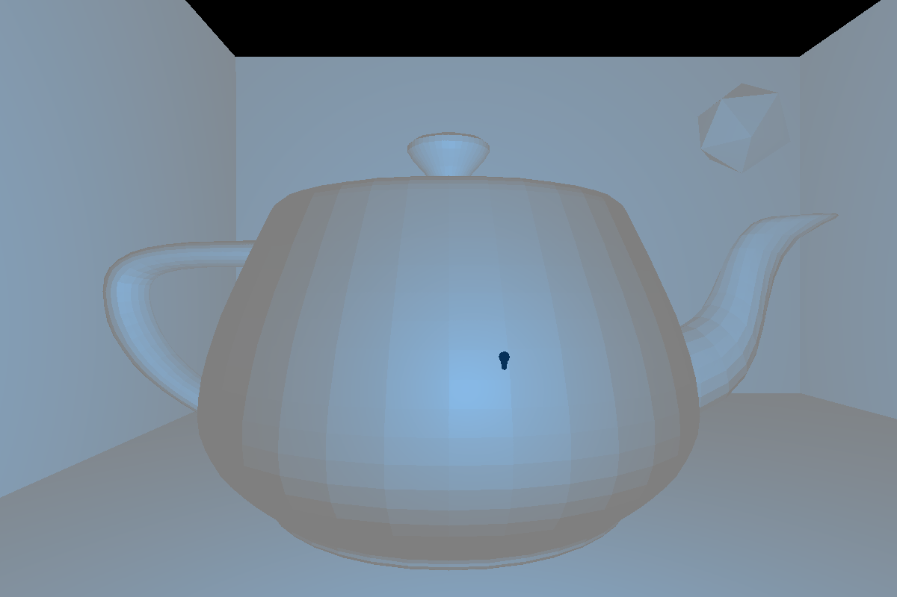
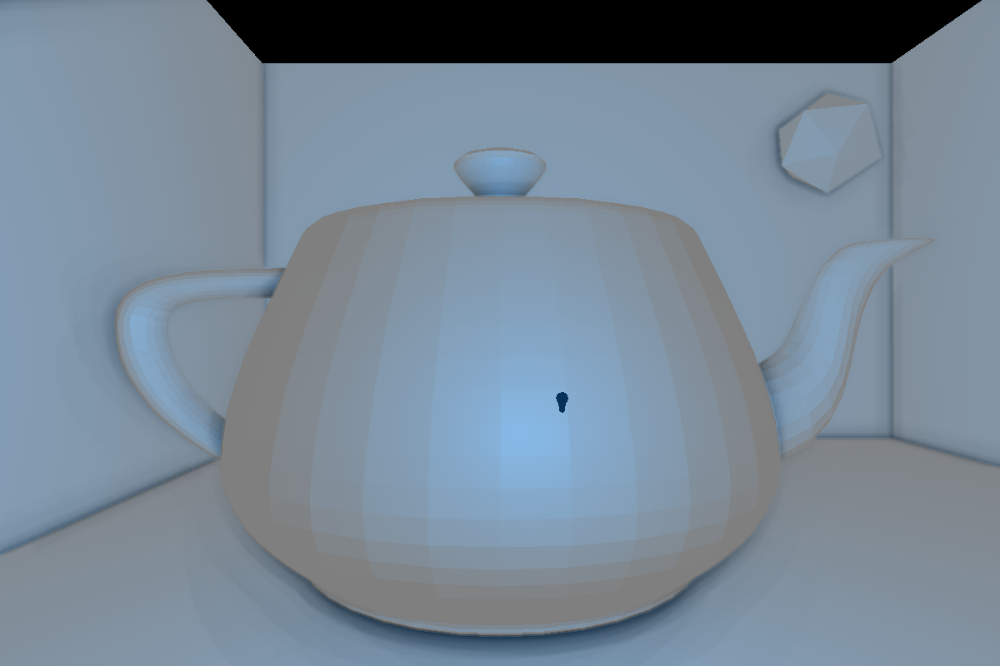
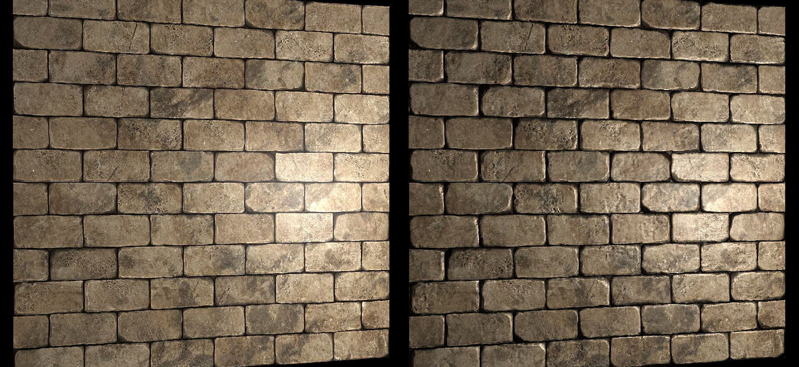
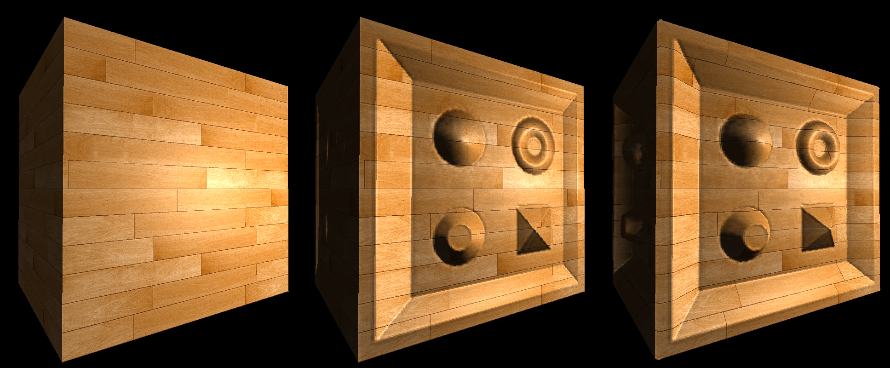